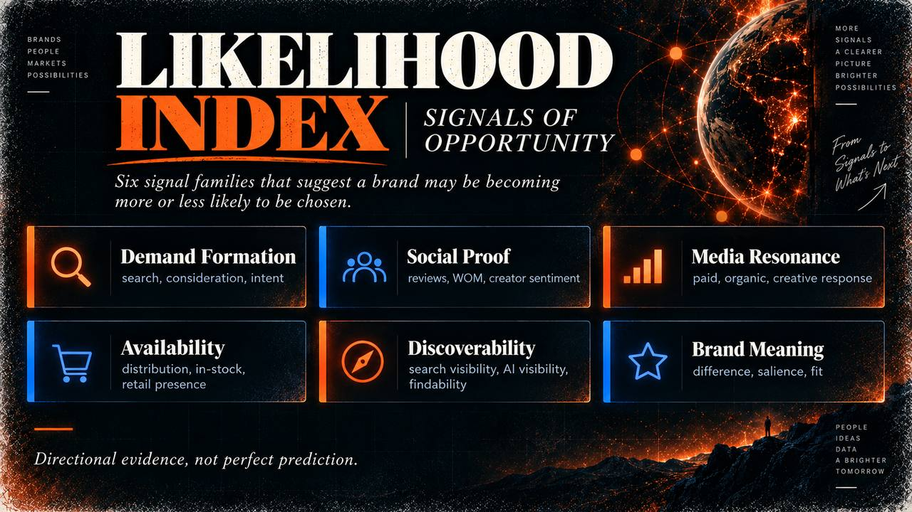
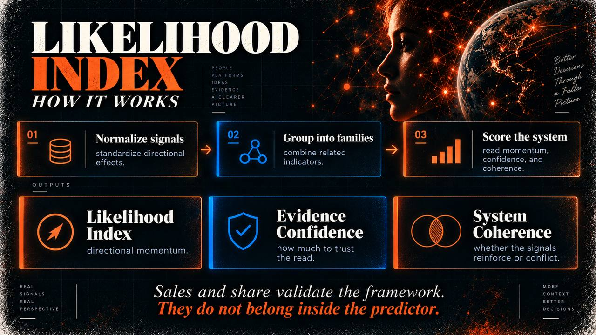

# Likelihood Index

**An open-source marketing measurement and brand analytics framework for estimating whether a brand is becoming more or less likely to be chosen.**

> Marketing doesn't make decisions. It changes the odds.



The **Likelihood Index** is an open-source framework inspired by *The Art of Likelihood*. It is designed for marketers, analysts, researchers, and builders who want a more transparent way to combine directional brand signals **without pretending that any single dashboard can perfectly replay why a person chose a brand**.

The central question is simple:

**Are we becoming more likely to be chosen — and what evidence supports that read?**

## What it outputs

The framework intentionally does **not** collapse everything into one magical score. It reports three separate measures:

1. **Likelihood Index** — directional momentum toward future choice.
2. **Evidence Confidence** — how much trust to place in the read.
3. **System Coherence** — whether independent signal families reinforce one another or conflict.

Actual outcomes such as sales, penetration, market share, and new-customer rate should remain **outside** the index and be used to validate whether the leading indicator system predicted the future.

## What it is not

- It is **not** a literal individual purchase-probability model.
- It is **not** an attribution model.
- It does **not** claim that correlation proves causation.
- It is **not** a substitute for incrementality testing, MMM, experimentation, or brand tracking.
- It is **not** a black-box score intended to replace judgment.

## Why this exists

Marketers increasingly work across paid media, organic content, creators, search, retail signals, reviews, AI discovery, and brand demand. Consumers do not experience those as isolated channels. They experience them as a stream of evidence.

The Likelihood Index is a practical attempt to:

- combine those signals more honestly,
- separate the **signal** from the **confidence in the signal**,
- account for whether signal families are **working together**,
- and create a bridge between brand thinking, media measurement, and future outcomes.

## How the model works



The model uses three lenses:

- **Likelihood Index** to estimate directional momentum.
- **Evidence Confidence** to express the quality and trustworthiness of the evidence.
- **System Coherence** to capture whether signal families reinforce one another or move in opposite directions.

## Default signal families

| Signal family | Default weight |
|---|---:|
| Demand Formation | 25% |
| Social Proof | 20% |
| Media Resonance | 20% |
| Availability | 15% |
| Discoverability | 10% |
| Brand Meaning | 10% |

The defaults are priors, not universal truths. They should be calibrated against future outcomes when sufficient historical data becomes available.

## Quick start

```python
from likelihood_index import LikelihoodIndex

model = LikelihoodIndex()

result = model.score({
    "share_search": 1.2,
    "consideration": 0.8,
    "purchase_intent": 0.6,
    "creator_sentiment": 0.7,
    "reviews": 0.9,
    "wom": 0.5,
    "creative_resonance": 1.0,
    "organic_signal": 0.4,
    "paid_signal": 0.8,
    "distribution": 0.2,
    "instock": 0.1,
    "ai_visibility": 0.3,
    "search_visibility": 0.5,
    "meaning": 0.4,
    "difference": 0.2,
    "salience": 0.6,
})

print(result)
```

Inputs are standardized effects, typically z-scores versus a brand baseline, category benchmark, or validated norm.

## Design principles

### 1. Normalize before aggregating
Metrics from different systems cannot be added raw. Convert each metric to a standardized directional effect first.

### 2. Bound outliers
The reference implementation applies a hyperbolic tangent transform so one viral post or anomalous observation cannot hijack the index.

### 3. Aggregate inside signal families first
This prevents a dozen social metrics from overpowering a small number of meaningful retail-availability metrics simply because there are more of them.

### 4. Weight by evidence quality
Recency, sample sufficiency, source quality, coverage, and independence should affect confidence.

### 5. Keep outcomes outside the predictor
Sales and market share validate the index. They should not be ingredients in the same score they are supposed to validate.

## Interpretation

| Index | Interpretation |
|---|---|
| 0–34 | Strong negative momentum |
| 35–44 | Weakening |
| 45–55 | Neutral / mixed |
| 56–65 | Strengthening |
| 66–100 | Strong positive momentum |

Always read the index together with **Evidence Confidence** and **System Coherence**.

## Repository structure

- `src/likelihood_index/` — reference implementation
- `tests/` — synthetic stress tests
- `examples/` — simple examples
- `docs/methodology.md` — model design
- `docs/validation.md` — recommended real-world calibration process
- `docs/GITHUB_REPO_SETUP.md` — recommended GitHub description, topics, preview, and release setup
- `.github/ISSUE_TEMPLATE/` — starter contribution prompts
- `RELEASE_v0.1.0.md` — first public release notes

## Contribute

If this framework is useful, **test it, challenge it, fork it, improve it, and share what you learn**.

Good contribution areas include:

- sample or synthetic datasets,
- notebook examples,
- alternative weighting schemes,
- confidence-calibration approaches,
- validation against real market outcomes,
- and better visualizations.

See `CONTRIBUTING.md` and the issue templates in `.github/ISSUE_TEMPLATE/`.

## Open-source philosophy

The ambition is not to create a proprietary black box. It is to create a more useful common language for asking:

**Are we becoming more likely to be chosen — and what evidence says so?**

## Status

**Experimental / pre-validation.** The reference implementation has been stress-tested with synthetic scenarios, but it has not yet been validated as a universal predictor of brand outcomes.

## License

Apache License 2.0. See `LICENSE`.
